https://www.cnblogs.com/shirleyya/p/16776893.html

https://github.com/guoshijiang/cryptography

https://www.bilibili.com/video/BV1fg4y1H7jU/?spm_id_from=333.999.0.0&vd_source=db5bf130bc81934e0880088323df6748

https://www.bilibili.com/video/BV1v44y1b7Fd/?vd_source=db5bf130bc81934e0880088323df6748


有没有大神可以解释一下基于BLS的阈值签名 如何实现 只要签名者数量达到阈值数目 就可以确定唯一的阈值签名 这是怎么做到的

就是门限签名，你可以研究下秘密分享原理，通过拉格朗日插值公式，t-1次多项式上选择n个点，任意t个点就可以恢复出多项式。


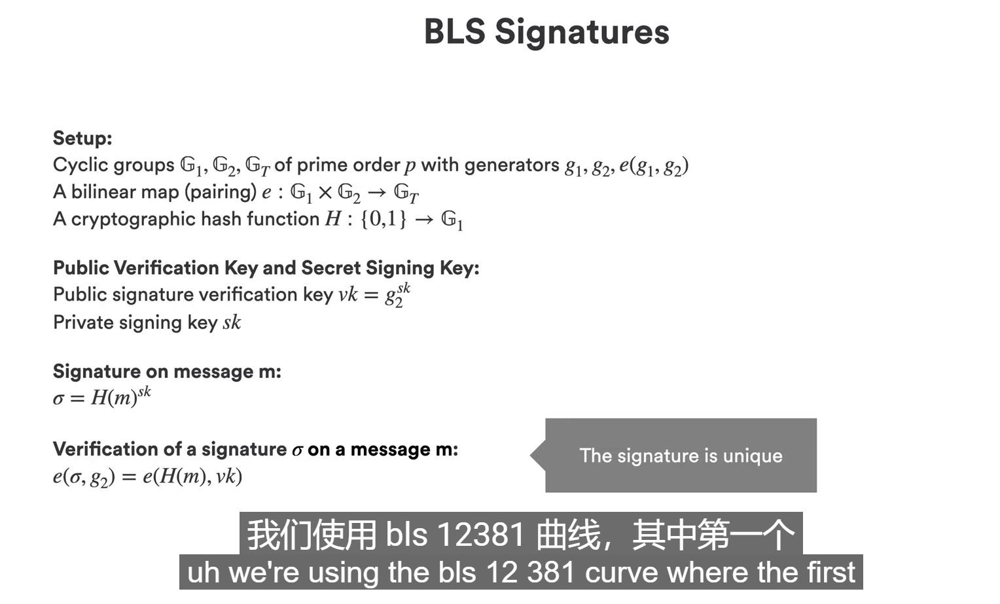


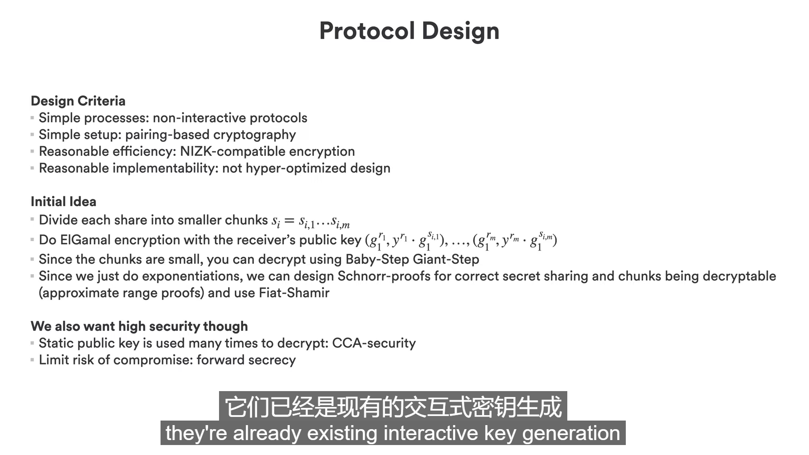


1. "Short Signatures from the Weil Pairing" by Dan Boneh and Matthew Franklin, ASIACRYPT 2001.
2. "Aggregate and Verifiably Encrypted Signatures from Bilinear Maps" by Dan Boneh, Ben Lynn, and Hovav Shacham, CRYPTO 2003.
3. "Practical Threshold Signatures" by Hugo Krawczyk, CRYPTO 2000.

这些论文详细描述了 BLS 阈值签名的数学证明过程，以及相关的安全性证明。


这篇论文提出了一种基于Weil配对的短签名方案。其中的签名算法原理可以概括如下:

1. Weil配对

Weil配对是定义在椭圆曲线群上的一种双线性映射,可以用于椭圆曲线密码学中解决一些问题。

具体而言,设E是一个定义在有限字段Fq上的椭圆曲线,P和Q是E上的两个不同阶的点。Weil配对是一个映射e: E[n] x E[n] -> F*qk,其中k是某个整数,满足以下性质:

(1) 双线性:对任意a,b属于整数环Zn,有 e(aP, bQ) = e(P, Q)ab

(2) 非退化:如果对任意Q属于E[n],都有e(P,Q) = 1,则P=O

(3) 可计算:对任意P,Q可以有效计算e(P,Q)的值

通过Weil配对,可以判断两个点是否线性相关,即e(P,Q)=1当且仅当P和Q线性相关。

1. Gap Diffie-Hellman群

Gap Diffie-Hellman群(GDH群)是一个循环群,其中计算离散对数问题是困难的,但判定离散对数问题是容易的。

具体来说,对GDH群G,给定g, ga, gb, 判断gab是否等于gc是容易的(Decisional DH问题),但给定g, ga, gb计算gab是困难的(Computational DH问题)。

通过在椭圆曲线上使用Weil配对,可以构造出GDH群。P在基域Fq上的一个子群G,Q在扩域Fqk上的一个子群G'。使用Weil配对判断(P,aP,Q,bQ)中a是否等于b是容易的,所以可以解决Decisional DH问题。但计算aP仍然是困难的,所以保持了Computational DH问题的难度。

1. GDH签名方案

利用GDH群的性质,可以构建如下签名方案:

* 密钥生成:选择随机的x,计算v = gx,其中v为公钥,x为私钥。
* 签名:对消息M,计算h = H(M), 其中H是全域哈希函数,映射到G*上。然后计算签名 σ = hx
* 验证:给定公钥v,消息M和签名σ,验证(g, v, h, σ)是否是一个DH tuple。

安全性依赖Computational DH问题的难度。简单来说,如果可以破解该签名方案,则也可以解决CDH问题。

1. 构造短签名

针对特定的椭圆曲线,可以使Weil配对实现在一个较小的子群上,于是签名就是子群元素,可以非常短。

本文使用的特定曲线是y2 = x3 + 2x ± 1在F3l上的曲线,其中l是小素数。该曲线的对应的GDH群使得签名长度是l比特,但安全性依赖于在F36l上的CDH问题。

所以通过选择较小的l,可以获得非常短的签名,但仍然保持高安全性。这是本文方案的核心创新点。

> 秘密共享和拉格朗日插值有什么关系

秘密共享和拉格朗日插值是密码学中两种不同的技术。秘密共享技术可以将一个秘密分成多个部分，这些部分可以分别由不同的人管理。拉格朗日插值是数学中一种插值技术，用于通过一些已知的点的值来推导其他未知的点的值。在密码学中，拉格朗日插值常常被用作加密算法的一部分，以提高算法的安全性。

在某些应用中，秘密共享技术和拉格朗日插值可以结合使用，以提高系统的安全性。例如，秘密共享可以用于分散管理秘密，而拉格朗日插值可以用于加密这些秘密，从而防止数据泄露。

> 拉格朗日插值是怎么加密信息的？数学原理是什么？

拉格朗日插值是一种数学技术，用于拟合一组数据点（x，y）以生成一个多项式模型。在加密信息中，拉格朗日插值可以被用来生成多项式，用于对数据点进行编码，以实现信息加密。

数学原理是，拉格朗日插值基于多项式插值的概念。拉格朗日插值的目的是通过找到一个给定数据点的最佳多项式拟合，以生成一个有效的多项式模型。这是通过选择一组数据点（x，y）并在这些点处计算一个多项式，使得这个多项式满足每个数据点（x，y）的要求，来实现的。由于多项式是比较易于编码和加密的，因此拉格朗日插值被认为是一种有效的信息加密方法。

> Dfinity的chain key技术的底层原理是什么

Dfinity的chain key技术的底层原理是分布式签名技术。它通过使用一组预定义的公钥和私钥来加密和解密信息，保证数据的完整性和保密性。在Dfinity的链上，每个节点都有一对公钥和私钥，并且通过与其他节点的协作来管理密钥。该技术还使用了哈希函数和随机数来生成链密钥，以提高安全性。

> 那DKG呢

DKG（分布式密钥生成）是指在多方环境中生成共享秘密的一种技术。它使用了数学算法，使得多方可以共同生成一个秘密密钥，而不需要其中任何一方拥有完整的密钥信息。这对于维护数据安全和隐私十分重要，因为数据只能用这个共享秘密解密。

> BLS阈值签名的数学原理是什么？

BLS (Boneh-Lynn-Shacham) Threshold Signatures是一种基于对椭圆曲线算法的阈值签名方案。它允许多个参与者共同签名一个消息，并且需要他们中的至少一个阈值数量的参与者签名才能生效。这个阈值数量可以在创建签名群体时设定。

数学原理是利用椭圆曲线对称性和对称性的技术，在公钥群体中计算出一个公共公钥，然后根据这个公共公钥生成消息的签名。每个参与者都持有一份私钥，并且只有当足够数量的参与者将他们的私钥提供给系统时，系统才能生成有效的签名。这个过程确保了恶意参与者不能单独篡改消息签名，因为他们无法获得足够数量的私钥。

> 请具体说明数学原理，并给出证明

BLS阈值签名是基于对称密钥密码学中的秘密分享技术的。它的数学原理是将一个秘密分成多份，并分配给多个参与者，以便让任意一个参与者都无法独立使用秘密，但当满足一定数量的参与者一起工作时，就可以使用秘密。

在BLS阈值签名中，一个私钥被分成多份，分配给多个参与者。当任意一个参与者想要签名一条消息时，他们必须首先将他们的私钥份额合并在一起。这个合并的私钥份额将用于生成签名。

在数学上，BLS阈值签名可以使用椭圆曲线加密来实现。具体而言，它使用了椭圆曲线点的乘积来生成签名。因此，当多个私钥份额合并在一起时，它们生成的签名将是它们对应的椭圆曲线点的乘积。

证明可以通过对椭圆曲线加密的数学理论进行证明，例如，证明椭圆曲线的一些性质，如群的单位元素、群的分配律、椭圆曲线点的乘法原理等。但是，由于这是一个相当复杂的证明，我不能在这里给出详细证明。


> 请作为老师，用尽可能通俗易懂的、口语化的方式给不了解它的人详细讲解以下内容：

好的,我会尽力用简单通俗的语言来解释这个区块链密码学概念。

这篇文章讲的是链上密钥密码学中的阈值签名。阈值签名是一种特殊的数字签名方式,它需要多个节点(或服务器)共同参与才能生成一个有效的签名。

简单来说,每个节点都持有签名私钥的一个“份额”,任意超过一个预设阈值数量的节点共同参与,就可以利用它们的“份额”来重建出完整的私钥,并生成一个有效的签名。

比如设置阈值为3,有5个节点,每个节点都持有私钥的一个“份额”。只要任意3个节点共同参与,就可以利用它们的3个“份额”重建出完整私钥,并生成签名。如果少于3个节点参与,是无法生成有效签名的。

这种机制可以提高安全性,因为攻击者需要同时控制超过阈值数量的节点,才能伪造签名。另一方面,也提高了可靠性,因为只要足够多的正常节点参与,就可以生成签名,即使个别节点发生故障也不会影响。

文章里介绍的是一个基于BLS签名算法改造的阈值签名方案。BLS签名本身是一个非常高效简洁的签名算法。文中详细讲解了如何将BLS签名扩展到阈值设置,通过分发私钥份额、重建签名等步骤,实现一个安全可靠的阈值BLS签名方案。

总之,阈值签名通过分布式密钥生成和重建签名的方式,实现了去中心化数字签名,既保证了安全性,也提高了可靠性。这在链上环境中非常实用,能够支持各种需要多方安全参与的场景。


> 再具体一点

好的,我来试着用更具体的例子解释一下阈值签名的工作原理:

假设有5个节点A,B,C,D,E,我们设置阈值为3,也就是任意3个节点参与才能生成签名。

首先,在初始化阶段,会为这个5节点集群生成一个公共的签名公钥,比如公钥是P。同时会为每个节点生成一个私钥“份额”,这些私钥份额加起来可以推导出签名的主私钥,我们称之为x。但x本身不会给任何一个节点,而是通过一定算法分成5个份额,分别给每个节点保管。

举例来说,可以用多项式分秘法来生成这5个份额。设节点A的份额为x1,B的为x2,以此类推。那么会构造一个3次多项式:

f(x) = x1 + x2x + x3x^2 + x4x^3

其中x1就是主私钥x。通过计算,可以得到:

A的份额x1 = f(0) B的份额x2 = f(1) C的份额x3 = f(2) D的份额x4 = f(3) E的份额x5 = f(4)

单独持有任何一个节点的份额,都无法推导出主私钥x。只有收集到至少3个节点的份额,才能通过多项式内插重建出x。

现在,当需要生成签名时:

1. 任意3个或以上节点共同参与,比如A、B、C
2. 每个节点利用自己的私钥份额分别生成一个“签名分片”,比如A生成σ1,B生成σ2,C生成σ3
3. 将这些签名分片合并就可以重建出针对公钥P的签名σ
4. 任何人都可以用P来验证σ的正确性

所以整个签名生成是分布式完成的,没有中心化私钥,需要多个节点协作才能签名。这就实现了可靠性与安全性的综合。

具体到文中提到的BLS算法,所谓的“签名分片”就是文中的σj,最后的重建签名σ就是直接将分片乘起来即可。这就是阈值BLS签名的整体流程。


Dfinity 的阈值签名算法是基于 BLS (Boneh-Lynn-Shacham) 算法实现的。

在 Dfinity 中，阈值签名是在公共曲线上进行的，并使用多项式插值进行阈值计算。具体而言，私钥节点对待签名的消息进行哈希，并对哈希值进行签名，生成一个签名点，然后将这些签名点组合成多项式。在验证阈值签名时，验证者通过使用一组公钥和多项式插值来验证签名是否合法。

此外，Dfinity 还使用了 ThresholdBLSSig 签名方案，该方案使用多项式和签名点的组合实现阈值签名。


下面是一个用 Rust 实现 BLS 阈值签名的简单代码示例：

```rust
rustCopy codeuse bls12_381::Scalar;
use bls12_381::{G1Affine, G1Projective};
use rand::Rng;

struct KeyPair {
    pub_key: G1Affine,
    priv_key: Scalar,
}

impl KeyPair {
    fn new() -> Self {
        let priv_key = Scalar::random(&mut rand::thread_rng());
        let pub_key = G1Projective::from(priv_key).into_affine();
        KeyPair { pub_key, priv_key }
    }

    fn sign(&self, message: &[u8]) -> Scalar {
        let hash = blake2b_simd::Params::new()
            .hash_length(32)
            .to_state()
            .update(message)
            .finalize();
        Scalar::from_bytes_mod_order(hash.as_bytes()).mul(self.priv_key)
    }
}

struct ThresholdSignature {
    pub_keys: Vec<G1Affine>,
    signature: Scalar,
}

impl ThresholdSignature {
    fn new(keys: &[KeyPair], message: &[u8]) -> Self {
        let pub_keys = keys.iter().map(|kp| kp.pub_key).collect();
        let signature = keys
            .iter()
            .map(|kp| kp.sign(message))
            .fold(Scalar::zero(), |acc, s| acc + s);
        ThresholdSignature { pub_keys, signature }
    }

    fn verify(&self, message: &[u8]) -> bool {
        let hash = blake2b_simd::Params::new()
            .hash_length(32)
            .to_state()
            .update(message)
            .finalize();
        let lhs = self
            .pub_keys
            .iter()
            .map(|pk| pk.into_projective())
            .fold(G1Projective::zero(), |acc, pk| acc + pk);
        let rhs = G1Projective::from(self.signature).mul_by_cofactor();
        lhs == rhs
    }
}
```

这段代码使用了 bls12_381 库实现 BLS 阈值签名，并使用了 blake2b_simd 库进行哈希计算。它实现了 KeyPair 结构体表示私钥/公钥对，以及 ThresholdSignature 结构体表示阈值签名。

它包括了两个结构体：`KeyPair` 和 `ThresholdSignature`。

`KeyPair` 结构体代表一对密钥。它包括一个公钥（`pub_key`）和一个私钥（`priv_key`）。它有一个 `new` 函数，该函数生成随机私钥并从私钥计算公钥。它也有一个 `sign` 函数，该函数对消息进行哈希，然后使用私钥对哈希值进行签名。

`ThresholdSignature` 结构体代表一个BLS阈值签名。它包括一组公钥（`pub_keys`）和一个签名（`signature`）。它有一个 `new` 函数，该函数从多个`KeyPair`对象中收集公钥，并使用多个私钥对消息进行签名。它也有一个 `verify` 函数，该函数对消息进行哈希，然后验证签名是否合法。


实现一个简单的 BLS 阈值签名算法库：

```rust
rustCopy codeuse curve25519_dalek::scalar::Scalar;
use curve25519_dalek::ristretto::CompressedRistretto;
use curve25519_dalek::ristretto::RistrettoPoint;
use sha2::{Digest, Sha512};

struct KeyPair {
    pub_key: CompressedRistretto,
    priv_key: Scalar,
}

impl KeyPair {
    fn new() -> Self {
        let priv_key = Scalar::random(&mut rand::thread_rng());
        let pub_key = RistrettoPoint::from_scalar(priv_key).compress();
        KeyPair { pub_key, priv_key }
    }

    fn sign(&self, message: &[u8]) -> Scalar {
        let hash = Sha512::digest(message);
        Scalar::from_hash(hash).mul(self.priv_key)
    }
}

struct ThresholdSignature {
    pub_keys: Vec<CompressedRistretto>,
    signature: Scalar,
}

impl ThresholdSignature {
    fn new(keys: &[KeyPair], message: &[u8]) -> Self {
        let pub_keys = keys.iter().map(|kp| kp.pub_key).collect();
        let signature = keys
            .iter()
            .map(|kp| kp.sign(message))
            .fold(Scalar::zero(), |acc, s| acc + s);
        ThresholdSignature { pub_keys, signature }
    }

    fn verify(&self, message: &[u8]) -> bool {
        let hash = Sha512::digest(message);
        let lhs = self
            .pub_keys
            .iter()
            .map(|pk| CompressedRistretto::decompress(pk).unwrap())
            .fold(RistrettoPoint::default(), |acc, pk| acc + pk);
        let rhs = RistrettoPoint::from_scalar(self.signature);
        lhs == rhs
    }
}
```

这段代码实现了 KeyPair 结构体表示私钥/公钥对，以及 ThresholdSignature 结构体表示阈值签名。它使用了 curve25519_dalek 库实现曲线操作，并使用了 sha2 库进行哈希计算。

其中，定义了两个结构体：`KeyPair` 和 `ThresholdSignature`。

`KeyPair` 结构体表示一对公钥和私钥，并实现了生成公钥和私钥对、签名和验证签名的方法。公钥使用 `CompressedRistretto` 压缩存储，私钥使用 `Scalar` 表示。

`ThresholdSignature` 结构体表示一组阈值签名，包括一组公钥和签名。它实现了生成阈值签名和验证阈值签名的方法。公钥组使用 `Vec<CompressedRistretto>` 存储，签名使用 `Scalar` 表示。生成阈值签名时，需要传入一组 `KeyPair` 和消息，算法会对消息计算哈希值，并对每个 `KeyPair` 生成的签名进行求和，得到阈值签名。验证阈值签名时，需要传入消息，算法会对消息计算哈希值，并验证左侧和右侧的值是否相等。

该代码使用了 curve25519_dalek 和 sha2 库，分别实现了加密算法和哈希算法。


BLS 阈值签名算法


阈值签名算法和阈值签名接力结构是DFINITY区块链网络实现不可破坏、不可操纵、不可预测随机性的关键技术。首先介绍阈值签名算法的原理和实现：

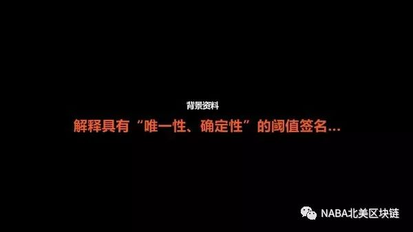

**一、传统签名及验签流程**

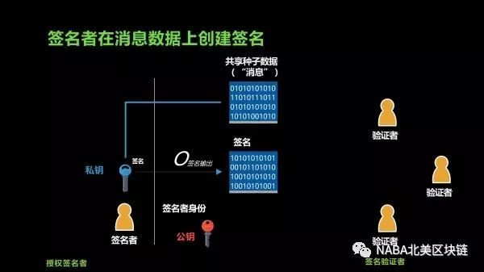

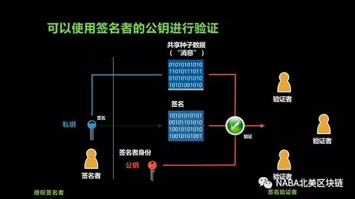

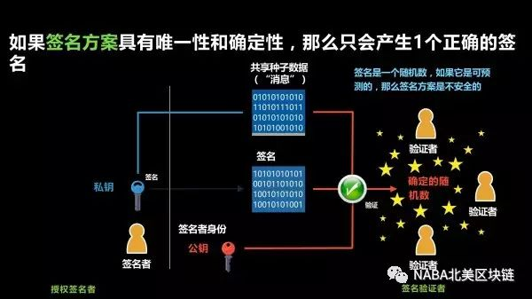


**二、阈值签名及验签流程**

传统签名方案如果可被预测（碰撞），那将完全失去安全效应，故DFINITY引入了阈值签名方案，它的流程如下：

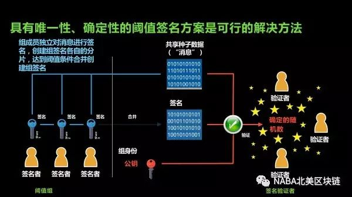

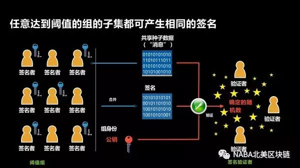

观察对比阈值签名方案与传统签名方案，我们归纳群组签名的特征：

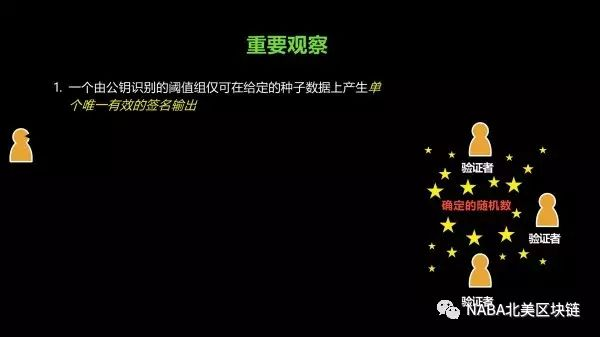


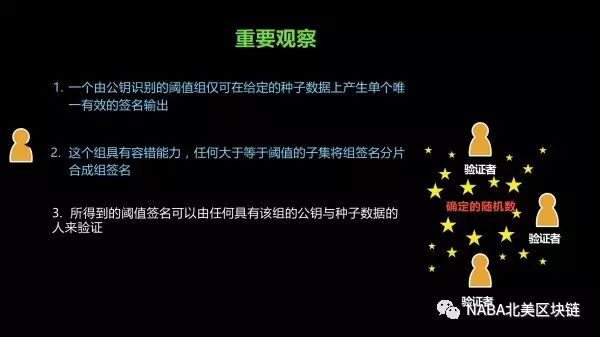

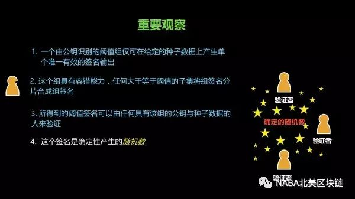

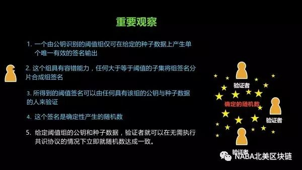

DFINITY引入的具有唯一性和确定性的阈值签名方案来源于斯坦福大学的BLS签名算法，BLS算法的创始人之一Ben Lynn为DFINITY核心成员，简单的参数和流程如下：

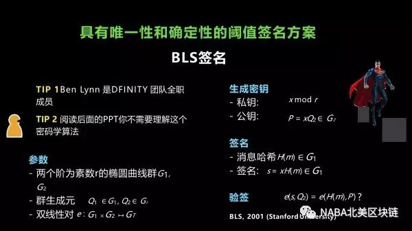


**三、阈值签名接力结构及VRF算法**

DFINITY网络的区块链“链式”数据结构由阈值签名接力模型替代，同时，DFINITY创造了新的基于VRF(可验证随机函数)的分布式算法，实现极高效率的最终确认性并提高安全性。实测可比当前以太坊系统提高50倍以上的性能。 DFINITY基于VRF可验证随机函数来安全的进行全球性的扩容：计算、验证和存储，真正实现无限的在线横向扩展。


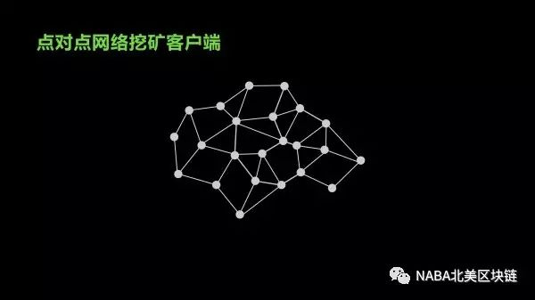

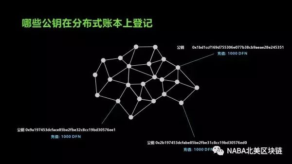

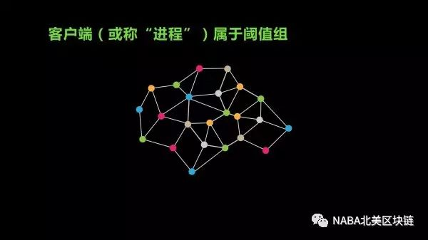

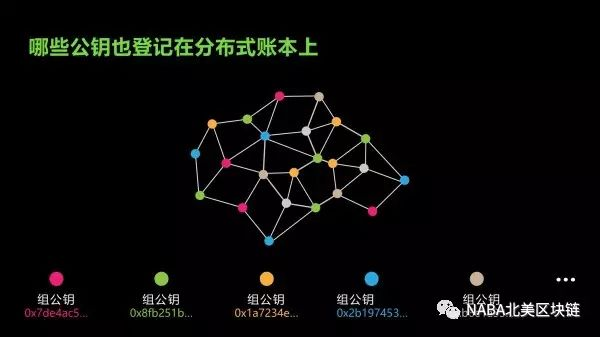

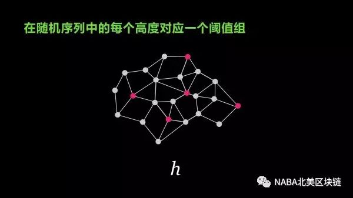

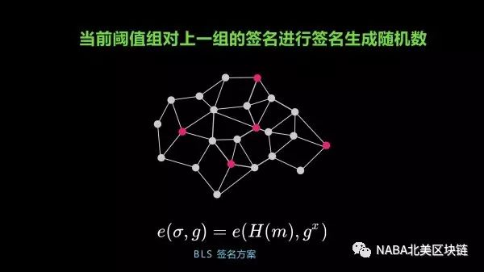

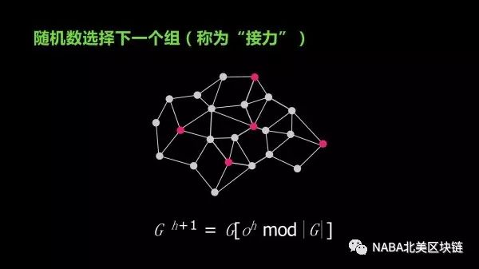

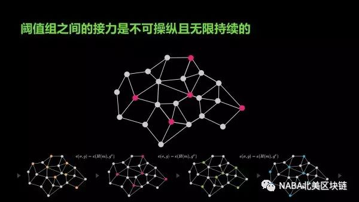

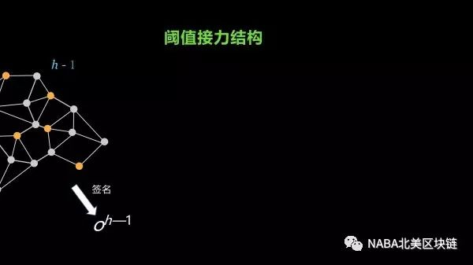

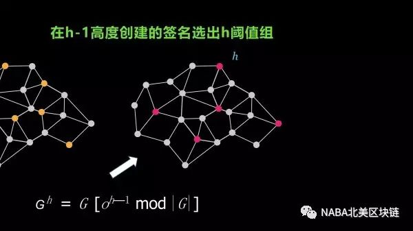


**四、容错能力和通信开销示例**

DFINITY 创造的 VRF 算法可实现极高的容错能力，以下示例介绍了在一个典型网络环境下的容错表现，在网路中有 30% 错误节点的情况下， DFINITY 网络无法有效出块的概念极低，算术证明见链接地址。

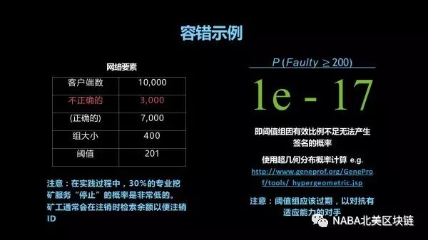

下图是DFINITY网络节点的数据通信开销示例，以下示例介绍了DFINITY网络内的消息格式和内容大小，携带每个节点签名分片的传输大小仅84比特，一个阈值组（400个节点）仅需22KB通信开销，在目前的互联网环境下，传输效率较高。

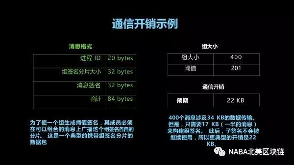


## 一、BLS签名算法简介

 BLS签名算法[1]是由斯坦福大学的 Dan Boneh、Ben Lynn 和 Hovav Shacham一同提出的。

 一般将 ECDSA签名算法、Schnorr签名算法和BLS进行对比。

 ECDSA签名算法局限性：

 无法进行签名聚合和密钥聚合。换句话说，当我们验证多重签名交易的时候，我们只能**逐个**对签名进行验证，显然这会耗费大量的区块空间和交易费。因此并不适用于多重签名场景。

 Schnorr签名算法：

 可以将一笔交易中的所有签名和公钥合并成单个签名和公钥，其过程是不可见的（即无法判断该签名或公钥是否通过合并得到的）。这样就可以实现只需要**一次**就可以对合并后的签名做验证，加快了区块验证的速度。

 但其仍然存在着局限性：

* 多重签名需要多次（签名者之间的）通信，这对冷钱包来说过于麻烦；
* 聚合签名算法依赖随机数生成器，而不像 ECDSA 那样可以使用指定的随机点（R）；
*  m-n 多重签名机制比较取巧，需要构建公钥的默克尔树。当 m 和 n 较大时，树所占空间会相当大；
* 无法把一个区块中的所有签名聚合成一个签名。

 与这两个签名算法作比较，BLS 有如下优点：

 （1）**不需要**随机数生成器，可以将区块中的所有签名**聚合成一个**；

 （2）**容易实现 m-n** **多重签名**，也可以避免签名者之间的多余通信；

 （3）**签名的长度更短**（签名为椭圆曲线上的一个点而非两个），是 Schnorr 或 ECDSA 的 2 分之一。

 

 

## 二、基础知识

 在对 BLS 算法进行阐述之前，首先了解一下曲线哈希和曲线配对。

### 2.1 曲线哈希

 **Hashing to the curve** 一般可以翻译为**曲线哈希**或者是**哈希成曲线上的点**。没了解之前听到曲线哈希可能会不知道是啥，但听到哈希成曲线上的点就大概知道意思了。

 在一般的哈希计算中，常常是对于不定长的输入最终**输出一个定长的数值**。但曲线哈希就不一样，其输出结果会对应到**椭圆曲线上的一个点**。

 具体做法如下：

 **哈希函数保持不变，将得到的哈希值作为点的 x 值寻找椭圆曲线上的对应点。**

 通常来说（比如比特币所用的曲线），椭圆曲线有 2²⁵⁶ 个点，而 SHA-256 哈希算法的值是 256 位。不过，一个有效的 x 坐标，会对应一正一负两个 y 坐标（因为（x, y）和（x, -y）都是曲线 y²=x³+ax+b 上的点）。换句话说，新的哈希算法大约有 50% 的概率在曲线上找到 2 个对应点，另 50% 的概率则一个点也找不到。因此，在应用过程中会出现需要尝试多次才能找到对应点的情况。

 · **有两个对应点**怎么解决呢？

 选择**y坐标较小**的作为结果即可。

 · 那出现**找不到对应点**的情况怎么办呢？

 可以在消息体**后面附加一个数**。当找不到对应点的时候，将**该数加一**再重新计算直到找到对应的点。

 下面给出一个例子。

 以在模为 23 的有限域上定义的椭圆曲线 y²=x³+7 为例。只有一半的 x 坐标在曲线上能找到对应点。

 ① 计算 hash(m||0)，没有对应的点。

 ② 计算 hash(m||1)，没有对应的点。

 ③ 计算 hash(m||2)，发现对应的点。对应的点有两个，选择y坐标较小的作为结果。


### 2.2 曲线配对

在曲线哈希中，我们将输入（一个值）映射到一个椭圆曲线上的点。显然，我们还需要能将点映射为数的函数。下面介绍一种特殊的函数，这种函数能够把一条（或 2 条不同的）曲线上的两个点 P 和 Q映射为一个数：

*e* ( *P , Q* ) *→ n*

此函数还要有一个重要的特性。即对于未知数 x 和两个点 P 、 Q ，无论哪个点乘以 x，结果相同，即：

*e* ( *xP , Q* ) = *e* ( *P , xQ* )

 

 

该函数还有如下性质：

*e* ( *aP , bQ* ) = *e* ( *P , abQ* ) = *e* ( *abP , Q* ) = *e* ( *bP , aQ* ) = *e* ( *P , Q* ) ab

 

这里就不对该函数的原理进行详细介绍，里面涉及到许多数学原理。但不出意外的话，我后面会更新一篇关于配对（pairings）的理论，感兴趣的话可以关注一下。

现在就只需要知道这种函数是存在的，并且它们有上面介绍的性质。除此之外，它并不会暴露x的任何信息。

值得注意的是，配对函数中不能使用任何椭圆曲线（特别是比特币的 secp256k1 椭圆曲线）。我们必须使用非常特殊的曲线（通常出自易于配对的曲线簇），才能保证函数的效率和安全。

 

## 三、BLS签名方案

现在终于能进入正题啦！

下面用 pk 表示私钥， P 表示公钥， m 表示待签名的消息。其中 P = pk×G.

### 3.1 签名

 ① 对消息m 进行曲线哈希得到H(m).

 ② 使用私钥进行签名。将刚刚得到的结果乘以私钥。

S = pk × H(m)

### 3.2 验证签名

在验证签名的时候，使用公钥 P 进行验证。验证过程如下：

*e* ( *P , H*(*m*) ) = *e* ( *G , S* ) 

### 3.3 原理

下面证明 *e* ( *P , H*(*m)* ) = *e* ( *G , S* ) 该等式成立。

已知：P = pk×G ，*e* ( *xP , Q* ) = *e* ( *P , xQ* ) .

*e* ( *P , H*(*m*) ) = *e* ( *pk × G, H*(*m*) ) = *e* ( *G , \*pk ×\* H*(*m*) ) = *e* ( *G , S* )

下图能够很直观的表示。BLS 签名验证，我们只需验证公钥和消息的哈希值（曲线上两个点）与曲线生成点和签名（曲线上另两个点）是否映射到同一个数（若是则说明这是一个有效的 BLS 签名）。


## 四、签名聚合

 前面提到BLS签名算法可以实现签名聚合，下面就来介绍这个非常棒的特性。

 现在假设在区块链的场景下，有一个区块有1000笔交易，每笔交易都由 签名Si、公钥Pi 和 消息mi 组成。现在我们只关心区块中所有的签名（而不是每一个）是否正确。为获得聚合签名，只需要将区块中的所有签名加起来：

*S=S*1*+S*2*+...+S*1000

 

 为了验证该区块是否正确，要保证下面这个等式成立。

 *e* ( *G , S* ) = *e* ( *P*1 *, H*(*m*1) ) × *e* ( *P*2 *, H*(*m*2) ) × ... × *e* ( *P*1000 *, H*(*m*1000) ) 

 如果签名是有效的，那么该等式是成立的。证明如下：（这里我直接放word里的截图）


 

 这里我们仍需用到所有的公钥，并计算 1001 次配对函数，好处是，区块中的签名只占 33 字节了。签名聚合可以由矿工在挖矿时完成，节省大量的区块空间。

### 4.1 n-n多重签名

使用多重签名的地址时，我们会对同一笔交易用不同的密钥进行签名。这种情况下，可以和 Schnorr 算法一样使用聚合密钥，把所有密钥和签名聚合成单个公钥和签名。

下面我们以 3-3 多重签名方案为例（同理可推导任意数量的多重签名方案）。一种简单的聚合方法，是把所有的签名和密钥加起来即可。即：

签名聚合结果：*S=S*1*+S*2*+\*S**3

密钥聚合结果：*P=P*1*+P*2*+\*P**3

 

可以验证以下等式依然成立：

*e* ( *G , S* ) = *e* ( *P* *, H*(*m*) ) 

证明如下：（这里我直接放word里的截图）


和 Schnorr 一样，我们也需要杜绝伪造密钥攻击。一种方法是要求每个签名参与者证明它拥有公钥对应的私钥（**用私钥给公钥签名**）。另一种方法是**加入非线性系数**，使得攻击无法实施。要做到这一点，聚合不再是简单的将多个密钥和签名相加，而是将它们分别乘以某个系数后再相加：

*S = a*1 *× S*1 *+ \*a**2 **×\* S*2 *+ \*a**3 **×\* *S**3

*P = a*1 *× P*1 *+ \*a**2 **×\* P*2 *+ \*a**3 **×\* *P**3

公式中签名和密钥的系数，可以通过签名者以及其它所有人的公钥计算得出，公式如下：

*a*i = *hash* (*P*i, {*P*1, *P*2, *P*3})

 

举个例子，可以简单的将签名者的公钥和所有人公钥拼接在一起算出系数：

 

*a*i = *hash* (*P*i || *P*1|| *P*2 || *P*3)

此时，上面的验证公式依然成立。虽然多了系数*a*i，但计算逻辑未变。

该方案的好处是，**无需在设备间进行多轮通信**，只需知晓其它签名者的相应信息即可。它可比 Schnorr 算法（需要 3 轮通信）的多重签名方案简单多了。这个方案也不依赖随机性，是一种具有完全确定性的签名算法。

### 4.2 m-n多重签名

上面对n-n多重签名进行了介绍，但实际中其实并不是很常见，更常用的是m-n多重签名。

Schnorr 签名算法中，我们用公钥组成的默克尔树来实现密钥聚合，这种方式效率不高，但是将将堪用。不幸地是，当 m 和 n 的值变大时，默克尔树的大小会呈指数增长。

 

BLS 使用了另一种方法，不过略复杂。我们需要一个普通哈希函数*hash*(*x*)（结果为一个数）和一个曲线哈希函数*H*(*x*)。开始多重签名时，还需要一个初始化过程，这之后，签名者之间就不再需要通信了，只需提供交易签名即可。

下面举个例子，我们要创建一个 2-3 多重签名，3 个签名存储在不同的设备上（这个例子可以扩展为任意的 m-n 多重签名）。

 **（1）生成成员密钥**

用 i = 1,2,3 来表示集合中相应位置的设备，用pki表示私钥，用Pi = pki×G表示公钥。我们用前面说的方法来聚合公钥：

*P = a*1 *× P*1 *+ \*a**2 **×\* P*2 *+ \*a**3 **×\* *P**3

其中，*a*i = *hash* (*P*i, {*P*1, *P*2, *P*3}) .

现在，每个设备都需要对每个*i*签名，以证明该*i*是聚合公钥中的一员。将签名聚合后，保存在对应的设备中：

MKi = (*a*1 *× \*pk\*1*) × *H( P , i ) + (\*a*2 \*× \*pk\*2\*) × \*H( P , i ) + (\*a\*3 \*× \*pk\*3\*) × \*H( P , i )*** 

这个签名被称作“成员密钥”，稍后签名时我们会用到。每个成员密钥都是对消息体*H( P , i )* 的 n-n 多重签名，即：

*e* (*G, MKi*) *= e* (*P, H*(*P , i*) )

证明如下：


记住这个等式，稍后还会用到。它用来证明某个设备是多重签名中的合法参与者。

 **（2）签名**

假设现在用 pk1 和 pk3 对交易进行签名，会生成两个签名 S1 和 S3 ：

*S*1 *= pk*1 *× H*(*P,m*) + *MK*1

*S*3 *= pk*3 *× H*(*P,m*) + *MK*3

将它们加起来，聚合成单一的签名和公钥：

(*S'*, *P'*) = (*S1+S3, P1+P3*)

用*P'*和*S',* 是为了强调它们只是由部分签名者参与计算的（公钥和签名），而不像 *P* 那样是由所有签名者参与计算的（公钥）。为了验证 2-3 多重签名，需证明如下等式成立：

*e*(*G,S'*) *= e*(*P',H*(*P,m*)) × *e*(*P,H*(*P,*1)+*H*(*P,*3))

上面说过，成员密钥 *MK*1 和  *MK*3 是对消息 *H*(*P,*1) 和 *H*(*P,*3)（消息本身由聚合公钥*P*签名）的签名，所以有：

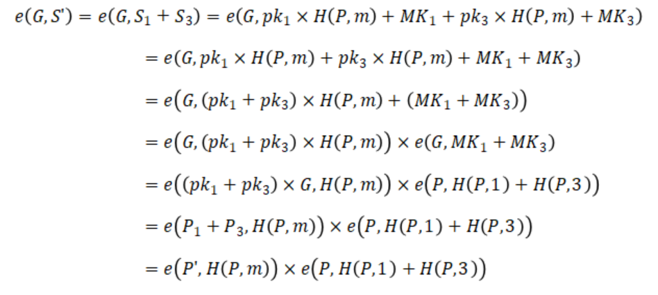

证明完毕。比 n-n 多重签名复杂一些，但仍然可以理解。


## 五、缺点

 ① 配对函数并不是十分高效

 ② 存在一种针对椭圆曲线加密体系的攻击-MOV攻击。该攻击能够利用配对函数来危害系统安全。所以对配对函数的使用要十分谨慎。


参考文献

[1] Boneh D , Lynn B , Shacham H . Short Signatures from the Weil Pairing[J]. Springer, Berlin, Heidelberg, 2001.


加密货币签名算法BLS （Boneh-Lynn-Sacham）是一种可以实现签名聚合和密钥聚合的算法（即可以将多个密钥聚合成一把密钥，将多个签名聚合成一个签名）。

在以太坊未来的 Casper 实现中，有非常多的验证者都要对区块签名，要保证系统的安全性，同时节约存储空间，就需要用到这类签名聚合的算法。

此前，Stepan Snigirev写过一篇关于BLS的文章，很好地解释了BLS背后的基础知识和数学。文章中Stepan还解释了BLS的一些属性（例如可聚合）和用例以及如何使用聚合签名来实现简单的阈值方案。

相比于其他签名算法（如ECDSA），BLS可以说是纯粹的魔法！

BLS拥有着独一无二的属性。此外，本文还将着重介绍一种分布式密钥共享方案和一个基于BLS的阈值签名方案。

提出的方案在链上产生单个公钥和签名，并且在发送到 m-of-n 地址或稍后交易输出时，不需要存储关于公钥共享或签名者的元信息。

事实上，它与任何普通的1对1地址或消费没有什么区别，但由于附加作用，它改善了隐私性。

**BLS的一些特质**

在众多签名算法中，BLS具有一些非常独特的属性。如果没有这些（属性），后来提出的秘钥共享方案也是不存在的。

换句话说，如果BLS没有这些属性，我们甚至不会知道其将如何运作。

**聚合性**

此前，我们对BLS聚合的特点做了详细的阐述，在此我们要着重关注的是，使用BLS，可以聚合所有类型的基元(密匙、公钥、签名)，而结果总是另一个有效的基元。

例如，如果聚合两个密钥，结果则是一个新的有效密钥。如果聚合密钥的两个对应的公钥，结果则将是一个新的公钥，且该公钥与之前聚合的密钥的公钥相匹配。

如果使用之前聚合的两个密钥和相同的哈希来创建的两个签名，那么新签名也将针对聚合的公钥进行验证。已经聚合的基元还可以进一步聚合，独立于聚合的顺序之外。

我们甚至可以这样概括。对于任何一组给定的密钥、公钥和签名元组，在其中一个基元上执行的任何操作，都可以在其他基元上重复相同的操作，并获得一个相互关联的新元组。

此外，如果操作嵌套更加复杂，其会更加适用。在这个方面，ECDSA算法就不可能做到。例如，多项式求值和插值可以与任何BLS原语一起使用，包括签名(非常难实现且受ECDSA限制)，该特性将会允许一些很有趣的事情发生，之后我们会具体说明。

**独特性和确定性**

BLS签名是惟一且和确定的。这意味着，对于任何给定的公钥和消息对，都只存在一个有效的签名。不可能存在两个不同的签名去验证相同的公钥和消息的情况。

与ECDSA相比，这是非常不同的，在ECDSA中，使用签名的随机性可能会导致相同公钥和消息对应的签名数量不可计数。

当涉及到包含BLS签名的其他消息时，其会产生积极的影响。比如“交易比特币”这种消息总是会产生相同的哈希值，并且不可能修改签名，消息是仍然有效的，但结果（哈希值）却不同。

如果将BLS用于加密货币，该特性将具有重大意义。它将一次性地修复交易延展性，而不需要特定的延展性修复。与ECDSA相比，BLS已经具有许多优势，而可塑性修复只是其中一种“免费”附加的功能。

此外，在BLS原语执行的每个操作都是确定的。这意味着，使用相同的输入可以重复一个操作。

例如，从一对密钥和哈希消息中创建签名，则生产的签名始终相同。这在一定程度上与BLS的唯一性有关，但也有一些其他含义。

确定性甚至适用于操作嵌套复杂的情况，其将允许非常有趣的用例和模式存在，其中最有趣的模式可能就是基于共享密钥的阈值签名。

**Shamir的秘密共享与BLS**

BLS描述的属性已经足够吸引人，但真正的魔力才刚刚开始。

Shamir（著名密码学专家）的秘密共享（Secret Sharing）是一种阈值方案，它已经为人所知很长一段时间，如果操作正确，它被证明是安全的。

Secret Sharing允许获取一个秘密并从中创建一组“秘密共享”。共享的秘密不会泄漏关于原始秘密的任何信息，因此它本身是无用的。只有收集到足够的信息(m-of-n)，才有可能从其中恢复原始秘密。

如果一个人只知道其中的一部分m-1，他仍旧会毫无头绪。秘密可以是任何由整数表示的东西，包括任意二进制或文本数据，或者更重要：秘钥。

简单来说，Shamir的Secret Sharing就是使用多项式求值去创建秘密共享，然后使用多项式插值来恢复原始秘密（具体概念可以在网络上搜索），在这里我们就不多做解释。

利用Secret Sharing已经开发出一些应用程序，然而，将其应用于加密公共秘钥，尤其是ECDSA，则仍存在一些问题。

从m-of-n组密钥共享中恢复密钥的人将获得原始密钥，使用ECDSA无法避免这种情况，因为要创建签名，需要拥有完整的密钥。

如果你是唯一的参与者，并且使用此方案将您的密匙划分为多个密匙共享，并希望将其存储在不同的位置，那么这在一定程度上是可以实现的。但当您的计算机在恢复时受到某种程度的危害，密钥就会处于危险之中，就会出现问题。

然而，对于BLS，情况就不同了。创建密钥共享与使用ECDSA的方法相同。不同之处在于，生成的共享密钥也是有效密钥，其可用于签署消息并创建有效的签名。这些签名只是“签名”共享，并且仅针对密钥共享的公钥进行验证。所以，光靠这些是没用的，没有人能用它们做任何事情。

神奇之处在于，如果你在m-of-n中采用签名共享，并执行与通常处理秘密共享相同的多项式插值，你将恢复一个新签名，该签名与使用原始密钥时创建的签名可能相同。但如果使用ECDSA，这将无法实现，因为你不能对签名执行任何有意义的操作。

这意味着，原始的密钥再也不会被观测到，你可以将密钥共享保留在原来的位置，而不必为了签署一条消息又一次临时复制它们。相反，你可以在不同的计算机、硬件钱包或其他设备上对消息进行多次签名，然后在一台计算机上收集签名共享，以便恢复最终签名。

下篇我们将对BLS算法如何应用于加密货币以及其表现情况做着重阐述。


上篇，我们对加密货币签名算法BLS的特性及其优势做了着重的阐述。本文，我们将对BLS如何应用于加密货币以及其工作原理做简要分析。

**将BLS应用于加密货币**

BLS最明显的用途是加密货币中m-n的多重交易，比如比特币。用户可以向他的钱包询问m-of-n地址，然后获得单个地址和密钥共享列表。之后，它会把“密钥分享”分配到不同的地方(电脑或硬件钱包)。钱包不会存储这些“密钥共享”，否则所有这些都将毫无意义。

生成的地址在内部只是原始密钥的公钥（并不再为人所知）。此外，该地址与普通的1-1BLS地址没有任何区别，这意味着任何人都不可能知道这实际上是一个m-n多重签名，也不知道涉及多少密钥或需要多少共享才能恢复密钥。

如此一来，对于m-n多重交易就不需要特殊的处理，因为在内部，验证一个简单的签名交易需要完全相同的验证（例如CHECKBLSSIG）。

目前，基于ECDSA的m-n预算需要有m个公钥和m个签名作为交易的一部分，这很容易导致在链上产生几个kB，从进而损坏其延展性。

此外，ECDSA还泄露了用于签署交易的密钥的相关信息。但如果使用基于BLS的阈值签名，预算的大小是固定的(例如32字节)，其独立于值m和n，也没有任何隐私泄漏。

**使其分布式且去信任化（免信任）**

上述方案本身已经很好了，但它有一个缺点，只有当创造者（交易商）是秘密共享的接收者的时候，它才会生效。因此，只有当你想要分发自己的密钥以避免安全问题时，它才会很好地工作。

如果涉及多方当事人需要签署交易的时候，则该方案存在问题。这需要对单一交易商的绝对信任。如果交易商不值得信任或妥协，原始密钥则可能被滥用或泄露。

幸运的是，由于BLS的特性，这个问题会很容易被修复。

我们可以让每个参与者都成为一个交易商，然后把多方的结果汇总起来，这样密钥就可以在没有任何人知道的情况下达成一致。

当然，它需要每方参与者进行一次验证，以确保其他各方都是诚实的。如果遇到不诚实的一方，整个过程必须中止。

这个过程需要对Shamir的秘密共享进行补充，所以我们首先要更详细地解释Shamir的秘密共享，然后讨论我们需要执行的添加选项。这些添加需要交换一些加密数据，因此每一方必须做的第一件事就是声明一个BLS公钥。

在Shamir的秘密共享中，创建了一个度数为n-1次的多项式S(x)。该多项式的第一个值(自由系数)是原始密钥，其余的n-1个系数是随机生成的密钥。多项式内部可以表示为一个简单的密钥向量。多项式中的参数“x”是一个唯一编号，用来标识参与的各方。

例如，它可以是每个参与方基于1的索引，但也可以是任何其他的公知值（例如公钥或哈希值）。为每一方计算这个多项式给出了每一方的密钥共享。

如果任何人知道这些秘密共享的“m”，则可以使用多项式插值来恢复原始密钥，这就是Shamir秘密分享的基础。

如果我们创建一个相同度数的新多项式P(x)，并将所有系数设置为第一个多项式中使用密钥的公钥，我们就可以使用这个新多项式生成与密钥共享对应的公钥共享。

这是由于BLS原语的属性，其中对两个对应的BLS原语（例如秘密和公钥）执行相同的操作将生成一个相应BLS原语的新元组。

这个多项式可以公开共享，并且不会泄露任何关于密钥的信息。它可以用来验证接收到的密钥共享实际上是在不知道多项式的情况下对多项式S(x)求值的结果。这只需要用P(x)计算公钥共享，并将结果与从接收的密钥共享所计算的公钥进行比较即可。

现在，为了使其分布式且去信任化，我们让每一方都创建自己的多项式S(x)和P(x)。然后每一方都公布P(x)以便让所有方都清楚存在的P(x)。

然后，每一方都将为另一方计算S(x)，并使用之前公布的公钥加密结果(密钥共享)。随后，每一方将加密的秘密共享发送给相应的其他方。在进行所有这些操作时，每一方还必须为自己执行的S(x)进行评估。

在此之后，每一方都应该接收到精确的“n”加密密钥共享，这意味着每一方都应该从另一方接收到一个密钥共享。如果缺少任何密钥共享或多项式P(x)，则整个过程中止。

当各方收到加密的秘密共享时，他们将首先解密并验证这些共享。验证是通过计算P(x)来执行的，其中x是自己的标识符（参与方列表中的索引）。如果计算的结果(公钥共享)与所接收密钥共享的计算公钥不匹配，则整个过程中止。

在这个阶段，每一方都应该有“n”个多项式P(x)和“n”个经过验证的秘密共享。记住，秘密共享使用的多项式S(x)的自由系数（第一个值）与原始密钥相同。这又意味着P(x)的自由系数是原密钥的对应公钥。

现在我们将所有多项式P(x)聚合成一个最终多项式FP(x)。由于BLS原语的属性，FP(x)的自由系数与最终密钥的公钥匹配。

然而，最终密钥是未知的，因为所有各方只知道各自的多项式S(x)，因此没有人能够聚合系数。FP(x)的自由系数（第一个值）是最后一个m-n公钥，并在随后用作支付地址。

我们还将所有接收到的密钥共享聚合为最终密钥共享。同样，由于BLS原语属性，最终得到的密钥共享与FS(x)的多项式求值结果相匹配。然而，FS(x)也是未知的，因为它还需要聚合所有单方多项式S(x)。

由于各个参与方可能已经决定在此阶段中止进程，所以在考虑使用m-n公钥进行任何支付之前，所有参与方必须首先宣布进程成功，这一点很重要。否则，即使某些其他方稍后无法提供签名共享，也可能会欺骗单方使用公钥。

因此，为了表示成功（协议），各方必须发布某种协议消息，并使用之前公布的公钥的密钥（不是密钥共享，而是最开始的那个）进行签署。

此外，协议消息必须包含本地聚合的m-n公钥，以便其他各方可以验证其与聚合的公钥相同。只有当一方遵守所有“n”所期望的协议时，它才会被认为m-n公钥是一个好的公钥。

从现在开始，我们将回到简单的Shamir秘密共享计划。每一方都有自己的密钥共享，并且能够创建签名共享。如果收集m-n签名共享，则可以使用多项式插值来恢复最终的签名。

这个签名还是普通的BLS签名，它针对m-n公钥进行验证，m-n公钥是FP(x)的自由系数。正如你可能猜到的那也，不需要对这些m-n地址和签名进行特殊处理，一个通用的CHECKBLSSIG就足够了。

整个过程听起来可能涉及很多交互性和沟通。然而，这可以简化为需要交换的几个消息。

每一方都可以将P(x)和所有单独加密的密钥共享打包成一条消息，从而将所需的通信减少到每一方3条消息，即公钥公告、共享分配和协议。

然而，这将允许观察者查看哪一个公钥已经达成一致（密钥仍然不为任何人所知）。

如果需要更多隐私，则每一方都应将每个P(x)和秘密共享单独加密发送给所有其他成员。

为了使其更加可用，可以使用中央服务（其中存在多个服务，可以选择一个）作为代理/调度程序，同时仍然保留单独的加密。

不管解决方案是什么，它都可以集成到钱包中，这样就可以隐藏所有的内部结构。最后，每一方只需选择其他方，并点击“生成m-n地址”即可。

**更加去中心化和自动化**

前面描述的过程可以完全去中心化和自动化。这涉及到一个多阶段的网络协议，该协议能够处理和容忍进程中的故障。容忍失败（故障）意味着协议能够从分布式密钥生成中踢出各个参与方，而不是中止整个过程。

**BLS的表现**

此前Stepan在其文中提到过，BLS 签名验证的复杂度要比 ECDSA 高上一个数量级。 在验证区块中 1000 笔交易的聚合签名时，仍需要进行 1000 次配对计算，这可能比使用 ECDSA 时（对 1000 个单独签名进行验证）还要慢。唯一的好处在于，可以在区块中放更多笔的交易，毕竟聚合签名只占 32 字节。

与 BLS 不同，Schnorr 验证算法的效率很高，它可以把签名放一起验证，效率是 ECDSA 算法的三倍。这样，问题来了，效率和安全哪个对我们更重要？

实际上，BLS 签名算法已经足够出色。它能将区块中的签名聚合成单一签名；能进行密钥聚合和 m-n多重签名（无需额外通信）；能避免使用随机数生成器。

这些优点使BLS显得如此简单优雅。当然，它仍有改进空间，标准化和优化也尚需时日。但我希望有朝一日，它能变得足够好，可以被纳入比特币协议中。这样的话，我们不但能获得它出色的功能，还可享受体积更小、聚合度更强的签名算法带来的好处。